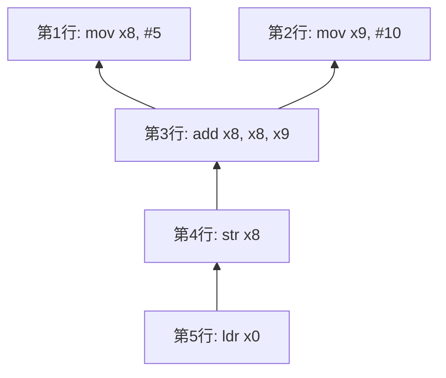
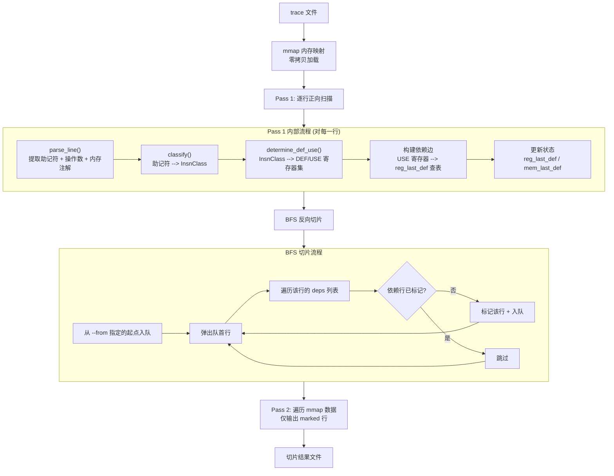
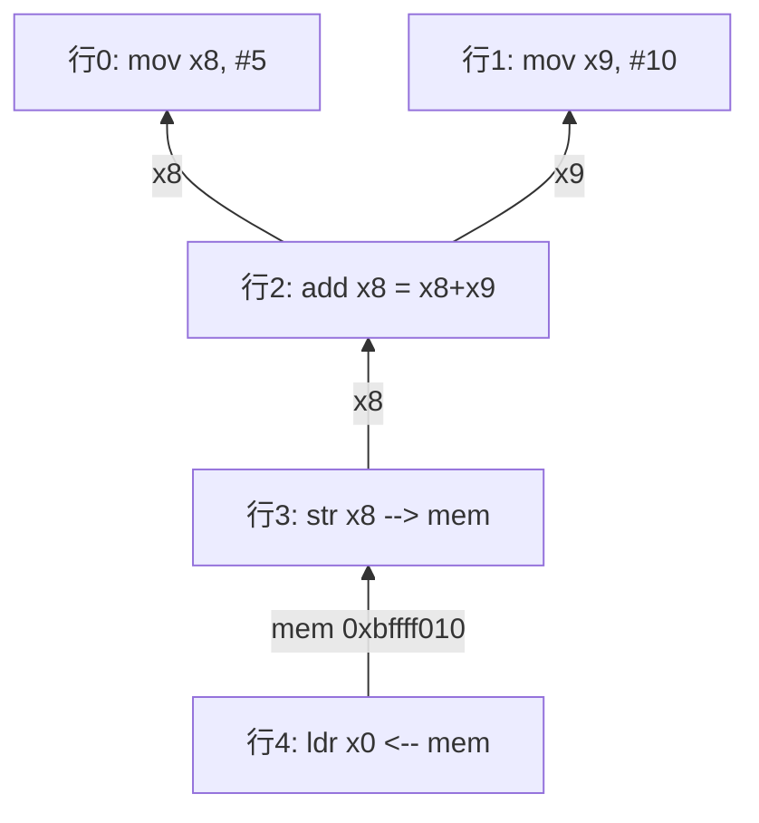

# trace-slice

**ARM64 动态指令 trace 离线向后切片分析器**

项目地址：[trace-slice](https://github.com/imj01y/trace-slice) 

## 目录

- [1. 项目介绍](#1-项目介绍)
- [2. 向后切片原理](#2-向后切片原理)
- [3. Trace 日志格式规范](#3-trace-日志格式规范)
- [4. 项目架构与运行原理](#4-项目架构与运行原理)
- [5. 编译方法](#5-编译方法)
- [6. 使用方法](#6-使用方法)
- [7. 已知局限](#7-已知局限)
- [8. 更新日志](#8-更新日志)

## 1. 项目介绍

### 这个工具解决什么问题

逆向算法还原中，目标二进制（安卓 SO 库、IoT 固件、桌面应用等）常常被 VMP（虚拟机保护）、CFF（控制流平坦化）、OLLVM 等混淆方案层层加固，静态分析几乎无法看清算法逻辑。逆向工程师通常借助 unidbg 等模拟执行框架，对目标函数进行动态指令级 trace，记录每一条 ARM64 指令的执行过程以绕过混淆。然而，这样产生的 trace 文件动辄几千万行、数 GB 大小。

在这些海量指令中，大量是混淆引入的膨胀代码——虚拟机调度循环中的寄存器搬运、控制流平坦化的跳转分发、与目标值无直接关联的中间计算等。要从中还原出算法的真实计算逻辑，人工逐行分析虽然并非不可能，但异常困难且极度耗时，自动化工具能从 trace 中直接提取出与目标值相关的指令子集，将分析效率提升几个数量级。

### 工具做了什么

trace-slice 实现了向后数据流切片（backward slicing）：给定一个"你关心的值"——某个寄存器的最终状态或某个内存地址的内容——工具会自动从该值出发，沿数据依赖链反向追踪，找出所有直接或间接参与该值计算的指令，输出仅包含这些指令的最小子集。所有与目标值无关的指令（混淆代码、无关寄存器操作等）都被自动过滤掉。

### 核心特性

- 向后数据流切片（backward slicing），自动去除与目标值无关的全部指令

- 字节粒度内存依赖追踪，精确处理不同宽度的 load/store（1/2/4/8/16 字节及 SIMD 128 位）

- 覆盖全部 150+ ARM64 助记符（40 个语义类别），包括 SIMD/NEON、原子操作等

- 可选控制依赖追踪（条件分支影响分析），通过 `--with-control-dep` 启用

- **值相等性剪枝**（默认启用）：当 LOAD 读取的值与对应 STORE 写入的值完全相等（纯值搬运）时，自动剪除 LOAD 的地址计算依赖链，大幅减少 VMP 地址噪音。可通过 `--no-prune` 禁用

- 高性能，实测 unidbg 的 2400 万行 2.8GB trace 日志文件，默认模式（含值剪枝）切片耗时约 8s，切片结果从 258 万行进一步精简至 128 万行（-50.3%）

  

## 2. 向后切片原理

### 2.1 什么是向后切片

向后切片（backward slicing）是一种经典的程序分析技术，由 Mark Weiser 于 1981 年首次提出（ICSE'81），并在 1984 年的 IEEE TSE 论文 *"Program Slicing"* 中系统阐述。它的目标很简单：给定程序中某个变量的某次取值，找出所有影响了这个值的语句。

可以用刑侦溯源来类比：你知道了案件的结果（某个寄存器最终存放的值），现在需要追查这个值是怎么一步步计算出来的——哪些指令提供了原始数据，哪些指令做了运算，哪些指令把中间结果搬到了最终位置。只有真正参与了这条"因果链"的指令才会被保留，其余全部排除。

与正向分析形成对比：正向分析是"跟踪所有变量，看每条指令会产生什么影响"，需要关注全局状态；而向后切片是"从结果反推，只保留真正参与计算的指令"，天然具有过滤能力。关键洞察在于：一条两千万行的 trace 中，与某个特定输出值相关的指令通常只占原始行数的一成左右，向后切片能精准地把这部分指令提取出来。

### 2.2 用真实 trace 举例

以下是 5 行 unidbg 格式的 ARM64 trace（为说明原理而简化）：

```
[00:00:00 001][lib.so 0x100] [d2800108] 0x40000100: "mov x8, #5" => x8=0x5
[00:00:00 001][lib.so 0x104] [d2800149] 0x40000104: "mov x9, #10" => x9=0xa
[00:00:00 001][lib.so 0x108] [8b090108] 0x40000108: "add x8, x8, x9" x8=0x5 x9=0xa => x8=0xf
[00:00:00 001][lib.so 0x10c] [f9000be8] 0x4000010c: "str x8, [sp, #0x10]" ; mem[WRITE] abs=0xbffff010 x8=0xf sp=0xbffff000 => x8=0xf
[00:00:00 001][lib.so 0x110] [f9400be0] 0x40000110: "ldr x0, [sp, #0x10]" ; mem[READ] abs=0xbffff010 sp=0xbffff000 => x0=0xf
```

逐行说明：

- 第 1 行：将立即数 5 赋值给寄存器 x8
- 第 2 行：将立即数 10 赋值给寄存器 x9
- 第 3 行：将 x8 和 x9 相加，结果写入 x8（x8 = 5 + 10 = 15）
- 第 4 行：将 x8 的值存入内存地址 0xbffff010
- 第 5 行：从内存地址 0xbffff010 读取值到 x0（x0 = 15）

**目标：追踪 x0 的值从何而来**

逐步反向追踪过程：

1. 起点：x0 在第 5 行被赋值，来源是 ldr 指令从内存地址 0xbffff010 读取的值
2. 谁最后写了 0xbffff010？——第 4 行的 str 指令把 x8 的值写入了该地址
3. 第 4 行的 x8 从哪来？——第 3 行的 add 指令定义了 x8 = x8 + x9
4. add 的两个输入从哪来？——第 1 行的 mov 定义了 x8 = 5，第 2 行的 mov 定义了 x9 = 10
5. mov 的输入是立即数常量，没有更上游的依赖，追踪结束

结论：5 行全部参与了 x0 的计算，全部保留在切片结果中。

依赖关系图（箭头表示"依赖于"）：



### 2.3 死代码消除

在上面的例子中，假设第 2 行和第 3 行之间插入了一行无关指令：

```
[00:00:00 001][lib.so 0x106] [d280e1ef] 0x40000106: "mov x15, #999" => x15=0x3e7
```

这行指令给 x15 赋值为 999，但在 x0 的整条计算链中，x15 从未被使用过。从第 5 行出发反向追踪时，永远不会触及这条指令，因此它被自动排除在切片结果之外。

这就是向后切片的核心价值所在。在真实的 VMP 混淆 trace 中，大量指令与你所关心的目标值没有数据依赖关系。向后切片能自动识别并过滤掉这些无关指令——实测 2400 万行的 trace 切片后保留约 258 万行（10.8%）。在此基础上，值相等性剪枝进一步将结果精简至约 128 万行（5.4%），剪除了大量 VMP 地址搬运噪音（详见[第 8 节更新日志](#8-更新日志)）。需要注意的是，切片保留的是所有与目标值存在数据依赖的指令，其中仍会包含 VMP 虚拟机调度循环中参与数据传递的指令（如寄存器搬运、虚拟栈操作等），这些并非核心算法逻辑但无法被数据流切片去除。

### 2.4 两种依赖类型

**数据依赖（默认启用）**

数据依赖描述的是值的直接传递关系：一条指令读取了某个寄存器或内存地址，而这个寄存器或内存地址的当前值是由之前的某条指令写入的。这是最核心、最基础的依赖关系，涵盖了寄存器赋值和内存读写两大类。

**控制依赖（通过 `--with-control-dep` 启用）**

控制依赖描述的是条件分支对指令执行的影响：某条指令是否执行，取决于之前某个条件分支的判断结果。

用 3 行示例说明：

```
第1行: cmp x8, #0        -> 比较 x8 和 0，设置标志位 nzcv
第2行: b.eq #0x40000200   -> 如果相等则跳转（控制流分支）
第3行: mov x0, x9        -> 这行是否执行取决于 b.eq 的结果
```

- 启用控制依赖后：追踪 x0 时，除了 x9 的数据来源，还会把 cmp 和 b.eq 纳入切片，因为它们决定了 mov x0, x9 是否会被执行
- 不启用时（默认）：只追踪数据流，即 mov x0, x9 中 x9 的来源

大多数场景下，仅使用数据依赖就足以提取核心算法逻辑。控制依赖适用于需要理解"为什么走了这条执行路径"的分析场景。

### 2.5 算法总览

trace-slice 的分析过程分为三步：

**Pass 1（正向扫描）**：从头到尾逐行扫描整个 trace 文件。对每一行，解析出指令的助记符和操作数，判断哪些寄存器/内存被读取（USE）、哪些被写入（DEF），然后记录行与行之间的依赖关系，构建完整的依赖图。

**BFS 反向切片**：从用户指定的目标（某个寄存器或内存地址在某一行的值）出发，沿依赖边进行反向广度优先遍历（BFS），标记所有传递可达的行。被标记的行就是与目标值相关的最小指令集合。

**Pass 2（输出）**：再次遍历 trace 文件，只将被标记的行写入输出文件，未被标记的行全部跳过。


---

## 3. Trace 日志格式规范

### 3.1 格式概述

本工具默认解析 unidbg 模拟器输出的 ARM64 指令 trace 格式。每行记录一条指令的执行信息，包含时间戳、模块偏移、机器码、PC 地址、反汇编文本、寄存器输入/输出值以及内存操作注解等字段。

### 3.2 字段详解

一行完整的 trace 示例（无内存操作）：

```
[00:00:00 001][lib.so 0x108] [8b090108] 0x40000108: "add x8, x8, x9" x8=0x5 x9=0xa => x8=0xf
|              ||            | |        | |         | |               | |                |  |
|  时间戳      || 模块+偏移  | |指令编码| | PC 地址 | | 反汇编文本    | | 输入寄存器值   |  | 输出寄存器值
|              ||            | |        | |         | |               | |                |  |
+--------------++-----------+  +--------+ +---------+ +---------------+ +----------------+  +------------
     跳过            跳过        跳过        跳过          解析           仅 validate       箭头  仅 validate
```

各字段说明：

| 字段 | 示例 | 工具是否解析 | 说明 |
|------|------|-------------|------|
| 时间戳 | `[00:00:00 001]` | 跳过 | unidbg 固定格式前缀的一部分 |
| 模块+偏移 | `[lib.so 0x108]` | 跳过 | unidbg 固定格式前缀的一部分 |
| 指令编码 | `[8b090108]` | 跳过 | 机器码十六进制 |
| PC 地址 | `0x40000108:` | 跳过 | 运行时绝对地址 |
| **反汇编文本** | `"add x8, x8, x9"` | **解析** | 双引号包裹，工具从此提取助记符和操作数 |
| 输入寄存器值 | `x8=0x5 x9=0xa` | 仅 validate 模式 | `=>` 前的 reg=val 对 |
| **箭头** | `=>` | **解析** | 区分有/无输出值的指令行 |
| **输出寄存器值** | `x8=0xf` | 仅 validate 模式 | `=>` 后的 reg=val 对 |
| **内存注解** | `; mem[WRITE] abs=0xbffff010` | **解析** | load/store 的内存绝对地址和读写方向 |

带内存写入操作（store）的完整行示例：

```
[00:00:00 001][lib.so 0x10c] [f9000be8] 0x4000010c: "str x8, [sp, #0x10]" ; mem[WRITE] abs=0xbffff010 x8=0xf sp=0xbffff000 => x8=0xf
```

带内存读取操作（load）的完整行示例：

```
[00:00:00 001][lib.so 0x110] [f9400be0] 0x40000110: "ldr x0, [sp, #0x10]" ; mem[READ] abs=0xbffff010 sp=0xbffff000 => x0=0xf
```

### 3.3 关键解析规则

1. **反汇编定位**：工具跳过行首 40 字节（unidbg 固定前缀区域），然后查找第一个双引号 `"` 来定位反汇编文本的起止位置。
2. **助记符提取**：双引号内第一个空格前的内容即为助记符（如 `"add x8, x8, x9"` 中助记符为 `add`）。
3. **操作数分割**：双引号内空格后的内容按顶层逗号分割为操作数列表（方括号内的逗号不分割，如 `[sp, #0x10]` 视为一个整体）。
4. **内存地址提取**：在反汇编文本之后搜索 `mem[` 关键字和 `abs=0x` 锚点，提取绝对内存地址。
5. **读/写方向**：`mem[READ]` 表示内存读取，`mem[WRITE]` 表示内存写入。
6. **箭头检测**：在反汇编文本之后搜索 ` => ` 模式，存在则表示该指令有输出值。
7. **寄存器归一化**：32 位寄存器 w 自动归一化为 64 位 x（如 w8 归一化为 x8）；SIMD 寄存器 q/d/s/b/h 统一归一化为 v（如 q0 归一化为 v0）。

### 3.4 适配其他 trace 工具

本工具默认为 unidbg trace 设计，但满足以下条件的其他 trace 格式也能兼容。

**必要条件：**

1. **行首前缀**：行首 40 字节内不能包含双引号 `"` 字符（工具跳过此区域后才搜索反汇编文本）。unidbg 的前 40 字节是固定的时间戳、模块名和地址前缀，天然不含引号。
2. **反汇编文本**：必须用双引号包裹，格式为 `"助记符 操作数1, 操作数2, ..."`。
3. **内存注解**：load/store 指令必须在行尾附加 `; mem[READ] abs=0x地址` 或 `; mem[WRITE] abs=0x地址`。
4. **输出标记**：有输出值的指令必须包含 ` => ` 箭头（validate 模式还需要 `reg=0xval` 值对）。

**修改前缀跳过长度：**

如果你的 trace 格式前缀长度不是 40 字节，需要修改源码中的跳过长度。具体位置在 `src/parser.rs` 文件的 `find_disasm_with_pos` 函数中：

```rust
let skip = 40.min(line.len());  // 修改 40 为你的 trace 格式前缀长度
```

**寄存器命名要求：**

必须使用 ARM64 标准寄存器名：
- 通用寄存器：`x0`-`x30` 或 `w0`-`w30`
- 栈指针：`sp` 或 `wsp`
- 零寄存器：`xzr` 或 `wzr`
- SIMD/FP 寄存器：`v0`-`v31`、`q0`-`q31`、`d0`-`d31`、`s0`-`s31`、`b0`-`b31`、`h0`-`h31`
- 条件标志：`nzcv`

**最小合规示例：**

```
XXXXXXXXXXXXXXXXXXXXXXXXXXXXXXXXXXXXXXXX"add x0, x1, x2" x1=0x1 x2=0x2 => x0=0x3
XXXXXXXXXXXXXXXXXXXXXXXXXXXXXXXXXXXXXXXX"str x0, [sp]" ; mem[WRITE] abs=0xbffff000 x0=0x3 sp=0xbffff000 => x0=0x3
XXXXXXXXXXXXXXXXXXXXXXXXXXXXXXXXXXXXXXXX"ldr x8, [sp]" ; mem[READ] abs=0xbffff000 sp=0xbffff000 => x8=0x3
```

（`X` 代表任意非 `"` 字符的填充，总共 40 个字符）

**不合规示例（缺少内存注解）：**

```
XXXXXXXXXXXXXXXXXXXXXXXXXXXXXXXXXXXXXXXX"str x0, [sp]" x0=0x3 sp=0xbffff000 => x0=0x3
```

缺少 `; mem[WRITE] abs=0x...`，工具无法识别内存写入，依赖链在此处断裂。

---

## 4. 项目架构与运行原理

### 4.1 模块总览

| 模块 | 文件 | 职责 |
|------|------|------|
| `types` | `src/types.rs` | 核心类型定义：RegId、ParsedLine、Operand、MemOp 等 |
| `parser` | `src/parser.rs` | 解析 trace 行文本，提取助记符、操作数、内存注解，生成 `ParsedLine` |
| `insn_class` | `src/insn_class.rs` | 将 150+ ARM64 助记符分类为 40 个 `InsnClass` 语义类别 |
| `def_use` | `src/def_use.rs` | 根据指令类别确定每条指令的 DEF（写入）和 USE（读取）寄存器集合 |
| `scanner` | `src/scanner.rs` | Pass 1 正向扫描，逐行构建依赖图，生成 `ScanState` |
| `slicer` | `src/slicer.rs` | BFS 反向切片标记相关行 + Pass 2 输出标记行 |
| `validate` | `src/validate.rs` | 自验证模式：检查 DEF/USE 语义表与 trace 实际寄存器值的一致性 |
| `main` | `src/main.rs` | CLI 入口，解析命令行参数，调用 lib 导出函数 |

### 4.2 核心数据结构

- **`RegId`**（u8 newtype）：用一个字节紧凑编码 66 个 ARM64 寄存器 -- x0-x30(0-30)、sp(31)、xzr(32)、v0-v31(33-64)、nzcv(65)。作为 FxHashMap 键时仅占 1 字节，最大限度减少哈希开销。

- **`ParsedLine`**：单行 trace 的解析结果，包含助记符、操作数列表、内存操作信息、箭头标记、基址寄存器、回写标志等。这是临时结构，每行创建、使用后即丢弃，不持久化存储。

- **`InsnClass`**（enum，40 个变体）：指令语义分类。每个变体对应唯一的 DEF/USE 模式，消除了在切片器中按助记符逐一匹配的需要。150+ 条助记符映射到 40 个类别后，`determine_def_use` 函数只需对 40 种情况做模式匹配。

- **`ScanState`**：Pass 1 扫描的完整输出，包含三个核心表：
  - `reg_last_def[RegId] -> line_index`：每个寄存器最后被哪一行定义（写入）
  - `mem_last_def[byte_address] -> line_index`：每个内存字节地址最后被哪一行写入
  - `deps[line_index] -> [dep_line_indices]`：每一行依赖的所有前置行索引列表

### 4.3 三趟处理流程



### 4.4 依赖图构建过程

以第 2 节的 5 行示例为例，逐行展示 `reg_last_def` 和 `deps` 的变化过程：

| 处理行 | 指令 | DEF | USE | 依赖查表结果 | deps[行号] | 状态更新 |
|--------|------|-----|-----|------------|-----------|---------|
| 行 0 | `mov x8, #5` | x8 | (立即数) | 无依赖 | [] | reg_last_def[x8] = 0 |
| 行 1 | `mov x9, #10` | x9 | (立即数) | 无依赖 | [] | reg_last_def[x9] = 1 |
| 行 2 | `add x8, x8, x9` | x8 | x8, x9 | x8->行0, x9->行1 | [0, 1] | reg_last_def[x8] = 2 |
| 行 3 | `str x8, [sp, #0x10]` | mem[0xbffff010] | x8 | x8->行2 | [2] | mem_last_def[0xbffff010] = 3 |
| 行 4 | `ldr x0, [sp, #0x10]` | x0 | mem[0xbffff010] | mem->行3 | [3] | reg_last_def[x0] = 4 |

对应的依赖关系图：



从行 4（`ldr x0`）出发做 BFS 反向切片：行 4 依赖行 3，行 3 依赖行 2，行 2 依赖行 0 和行 1。最终 5 行全部被标记，输出完整的切片结果。

### 4.5 内存依赖的字节粒度追踪

ARM64 有多种不同宽度的 load/store 指令：`ldrb`（1 字节）、`ldrh`（2 字节）、`ldr w`（4 字节）、`ldr x`（8 字节）、`stp x`（16 字节）、`str q`（16 字节）。一条 `stp x5, x6, [sp]` 写入 16 字节，但后续的 `ldrb w0, [sp, #8]` 只读取其中第 9 个字节。如果只按起始地址匹配内存依赖，会产生大量虚假依赖或遗漏依赖。

trace-slice 采用字节粒度追踪：每个字节地址独立记录最后写入行。访问宽度（`elem_width`）从助记符和寄存器前缀推导 -- 助记符后缀优先（如 `ldrb` 对应 1 字节、`ldrh` 对应 2 字节），否则按首个操作数的寄存器前缀推导（`w` 对应 4 字节、`x` 对应 8 字节、`q` 对应 16 字节）。这样，一条 `str x8, [sp]` 会在 `mem_last_def` 中写入 8 个连续字节地址的记录，后续任何宽度的 load 都能精确匹配到实际存在数据依赖的那些字节。

---

## 5. 编译方法

### 5.1 环境要求

- Rust 工具链（stable，edition 2021）
- 安装方式：<https://rustup.rs/>
- 操作系统：Windows / Linux / macOS 均可
- 无其他外部依赖，全部通过 Cargo 自动下载

### 5.2 构建步骤

```bash
git clone https://github.com/imj01y/trace-slice.git
cd /trace-slice
cargo build --release
```

构建完成后，生成的二进制文件位于 `target/release/trace-slice`（Windows 下为 `trace-slice.exe`）。

### 5.3 运行测试

```bash
cargo test
```

测试包含两部分：

- **单元测试**：各模块内部的 `#[cfg(test)]` 测试，覆盖解析、分类、DEF/USE 判定等核心逻辑
- **集成测试**：`tests/test_slicing.rs`，使用 fixture 文件进行端到端切片验证

测试 fixture 文件位于 `tests/fixtures/` 目录，共 19 个 `.trace` 文件，涵盖各类指令组合和边界情况。

### 5.4 依赖列表

| 依赖 | 版本 | 用途 |
|------|------|------|
| `clap` | 4.x | 命令行参数解析（derive 模式） |
| `smallvec` | 1.x | 栈上小向量，减少堆分配 |
| `bitvec` | 1.x | 位向量，用于标记切片行 |
| `rustc-hash` | 2.x | FxHashMap，高速非加密哈希表 |
| `memchr` | 2.x | SIMD 加速的字节和行搜索 |
| `memmap2` | 0.9.x | 内存映射文件，实现零拷贝 I/O |
| `anyhow` | 1.x | 简洁的错误处理和传播 |

---

## 6. 使用方法

### 6.1 基本语法

```bash
trace-slice <TRACE_FILE> --from <SPEC> [OPTIONS]
```

### 6.2 `--from <SPEC>`（切片起点，核心参数）

这是最重要的参数，用于指定向后切片的起点。可以多次指定，支持以下四种格式：

| 格式 | 含义 | 示例 |
|------|------|------|
| `reg:NAME@last` | 追踪寄存器在 trace 中最后一次被赋值的位置 | `--from reg:x0@last` |
| `reg:NAME@LINE` | 追踪寄存器在第 LINE 行（1-based）处的定义 | `--from reg:x8@5000` |
| `mem:ADDR@last` | 追踪内存地址最后一次被写入的位置 | `--from mem:0xbffff010@last` |
| `mem:ADDR@LINE` | 追踪内存地址在第 LINE 行处的写入 | `--from mem:0xbffff010@1234` |

**支持的寄存器名**

通用寄存器 `x0`-`x30`、`w0`-`w30`，栈指针 `sp`，零寄存器 `xzr`、`wzr`，SIMD/FP 寄存器 `v0`-`v31`、`q0`-`q31`、`d0`-`d31`、`s0`-`s31`，条件标志 `nzcv`。

**行号是 1-based**

第一行是 1 不是 0。所有 `@LINE` 格式中的行号均从 1 开始计数。

**多起点**

可以多次使用 `--from`，结果是所有起点依赖链的并集。例如：

```bash
trace-slice trace.txt --from reg:x0@last --from reg:x1@last
```

这会同时追踪 x0 和 x1 的来源，输出的切片包含两者所有相关指令的合集。

**`@LINE` 自动回退**

若指定行并未 DEF 该寄存器（例如该行是 USE 而非 DEF），工具自动回退到该行之前最近一次 DEF 该寄存器的行。这保证了即使行号不精确，也能找到正确的切片起点。

**内存地址格式**

支持带 `0x` 前缀（`mem:0xbffff010@last`）和不带前缀（`mem:bffff010@last`）两种写法，效果相同。

### 6.3 `-o, --output <PATH>`

指定输出文件路径。

```bash
trace-slice trace.txt --from reg:x0@last -o sliced.txt
```

- 默认输出到 stdout
- 指定文件时，若存在未知助记符会额外生成 `<PATH>.summary.txt` 摘要文件

### 6.4 `--with-control-dep`

启用控制依赖追踪。

```bash
# 仅数据依赖（默认）
trace-slice trace.txt --from reg:x0@last -o data_only.txt

# 数据 + 控制依赖
trace-slice trace.txt --from reg:x0@last --with-control-dep -o with_ctrl.txt
```

- 默认仅追踪数据依赖
- 启用后追踪条件分支（b.eq, cbz, cbnz, tbz 等）对后续指令的控制影响
- 何时需要：怀疑某些计算路径是被条件分支选择的结果时

### 6.5 `--start-seq <N>` / `--end-seq <N>`

限定分析范围。

```bash
# 只分析第 10000 到第 50000 行
trace-slice trace.txt --from reg:x0@last --start-seq 10000 --end-seq 50000
```

- 行号为 1-based
- `--start-seq`：跳过该行之前的所有行
- `--end-seq`：含该行，之后全部跳过
- 用途：缩小分析范围以加速处理，或只关心 trace 中某个函数调用区间

### 6.6 `--no-prune`

禁用值相等性剪枝，保留完整地址依赖链。

```bash
# 默认模式（启用剪枝）
trace-slice trace.txt --from reg:x0@last -o sliced.txt

# 禁用剪枝，保留所有地址计算依赖
trace-slice trace.txt --from reg:x0@last --no-prune -o sliced_full.txt
```

- 默认启用值相等性剪枝：当 LOAD 读取的值与对应 STORE 写入的值完全相等时，跳过 LOAD 的地址寄存器依赖（内存数据依赖始终保留）
- 使用 `--no-prune` 回退到完整切片，适用于需要查看地址计算过程的调试场景
- 剪枝对 S-box 查表（值不等）、SIMD 128-bit、pair 指令不生效，保证算法指令完整

### 6.7 `--validate`

自验证模式。

```bash
trace-slice trace.txt --validate -o validation.txt
```

- 不做切片，而是逐行检查工具内部的 DEF/USE 语义表是否与 trace 中 `=>` 箭头前后的寄存器值一致
- 用途：调试工具自身、确认某个 trace 格式被正确解析
- 此模式不需要 `--from` 参数

### 6.8 `--profile`

输出各阶段耗时分解。

```bash
trace-slice trace.txt --from reg:x0@last --profile
```

耗时信息输出到 stderr，示例：

```
[profile] I/O (mmap+lines): 1.33s
[profile] parse_line:        9.76s
[profile] classify+def_use:  1.31s
[profile] dep tracking:      1.32s
[profile] state update:      1.27s
```

### 6.9 完整使用示例

**示例 1：最简用法 -- 追踪 x0 的来源**

```bash
trace-slice trace.txt --from reg:x0@last -o sliced.txt
```

stderr 输出示例：

```
[扫描] 正在解析 trace.txt...
[扫描] 完成：23749824 行，6740000 个内存地址 (8.5s)
[扫描] 切片起点 (1-based): [23749800]
[切片] 标记 2580000 / 23749824 行 (10.8%) (0.1s)
[输出] 2580000 行写入到 sliced.txt (1.0s)
总耗时：9.6s
```

**示例 2：多起点 + 控制依赖**

```bash
trace-slice trace.txt \
    --from reg:x0@last \
    --from mem:0xbffff010@last \
    --with-control-dep \
    -o full_slice.txt
```

**示例 3：限定范围 + 指定行号**

```bash
trace-slice trace.txt \
    --from reg:x8@5000 \
    --start-seq 1000 \
    --end-seq 10000 \
    -o range_slice.txt
```

---

## 7. 已知局限

| 局限 | 说明 |
|------|------|
| 仅支持 ARM64（AArch64） | 不支持 ARM32（Thumb）、x86、MIPS 等其他架构 |
| 仅支持 unidbg trace 格式 | 其他格式需按第 3 节适配指南调整解析器 |
| 依赖图不持久化 | 每次运行都重新构建依赖图，无法缓存复用 |
| pair 指令的近似 | ldp/stp 16 字节访问已有 bit-tagged 精度优化，但极少数场景仍存在过近似 |
| 不支持自修改代码 | 假设代码段在 trace 期间不变 |
| 未知助记符按 NOP 处理 | 未识别的指令被当作无副作用，可能丢失依赖（会在 summary 文件中警告） |

---

## 8. 更新日志

### 2026-03-08：值相等性剪枝（Value Equality Pruning）

**功能说明**

新增值相等性剪枝优化，默认启用。当 LOAD 指令从内存读取的值与对应 STORE 指令写入的值完全相等（纯值搬运，即 pass-through）时，自动跳过该 LOAD 的地址寄存器依赖，仅保留内存数据依赖（STORE→LOAD 链）。这大幅减少了 VMP 虚拟机中地址计算指令的噪音——指针递增、索引偏移、基址搬运等与算法逻辑无关的指令被精准剪除。

可通过 `--no-prune` 标志禁用，回退到完整切片。

**原理**

在 VMP 混淆的 trace 中，大量 LOAD 指令只是将值从一个内存位置搬运到寄存器，不涉及任何变换。例如虚拟栈的 push/pop 操作：STORE 将值写入栈地址，随后 LOAD 从同一地址原样读回。此时追踪 LOAD 的地址计算链（如何算出栈指针地址）对理解算法逻辑毫无意义。

值相等性剪枝在 Pass 1 扫描阶段判定每条 LOAD 是否为 pass-through：

1. **同源检查**：LOAD 访问的所有字节是否来自同一条 STORE（`all_same_store`）
2. **值提取**：从 trace 文本中提取 STORE 的数据寄存器值和 LOAD 的目标寄存器值，按访问宽度掩码
3. **相等判定**：两值完全相等则判定为 pass-through，跳过该 LOAD 的地址寄存器依赖

**安全性保障**

| 场景 | 是否剪枝 | 原因 |
|------|---------|------|
| 纯值搬运（store_val == load_val） | 剪枝 | 地址链无算法意义 |
| S-box / T-table 查表（store_val ≠ load_val） | 不剪枝 | 值经过非线性变换，地址依赖承载算法语义 |
| 初始内存读取（trace 中无对应 STORE） | 不剪枝 | `has_init_mem=true` 阻断剪枝条件 |
| SIMD 128-bit（q 寄存器，超 u64 范围） | 不剪枝 | 值提取为 None，不满足判定条件 |
| Pair 指令（ldp/stp） | 不剪枝 | 第二半值提取为 None |

**实测效果（2400 万行 / 2.88GB trace）**

| 指标 | 无剪枝（`--no-prune`） | 默认（含剪枝） |
|------|----------------------|----------------|
| 切片结果行数 | 2,581,259（10.8%） | **1,283,928（5.4%）** |
| 依赖边数 | 30,324,574 | 27,344,581 |
| pass-through LOAD 数 | - | 2,588,002 |
| 切片减少比例 | 基线 | **-50.3%** |

关键算法指令验证（剪枝 vs 无剪枝）：

| 算法组件 | 剪枝后 | 无剪枝 | 状态 |
|---------|--------|--------|------|
| GF_MUL 函数调用 | 576 | 576 | 100% 保留 |
| SIMD ushr 指令 | 4,627 | 4,627 | 100% 保留 |
| ldrb 指令 | 81,405 | 103,947 | 地址计算 ldrb 被剪，数据 ldrb 保留 |

剪枝结果是无剪枝结果的严格子集（`comm -23` 验证 0 行差异），不会引入任何新行。
